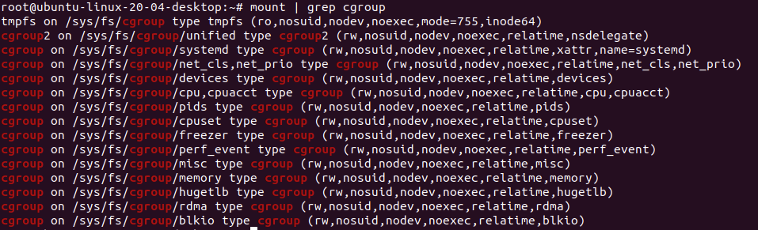

# Container
## Containers from scratch in Go. 

To be precise; 

1. Image creation without Docker compliant with [OCI Image Format Specification](https://github.com/opencontainers/image-spec/blob/main/spec.md) [v 1.0.2 release](https://opencontainers.org/release-notices/v1-0-2-image-spec/). This broadly means, any  container runtime can `run`the images that we created, any registry should accept our images when we register.
2. Containerization with the image that we built, establishing : namespaces, cgroups, volumes, networking and if we can security. We will discover how far we can go when we try them rootless.

### We expand on the Talk of Liz Rice and her sequel on 'Containers from scratch'
- The first security test is introduced here : 
	- Fork bomb (this is what Liz tries after she establishes the CGroups)
	- child command is unsecure though

### Namespaces
- If you `go run main.go run /bin/bash` you will be running a shell inside it. With the `syscall.CLONE_NEWUTS` flag, hostname namespace is isolated. After you run the shell, if you type `hostname` you will see your Ubuntu hostname. You can change it like `hostname container` making its hostname 'container'. Check it with `hostname`, and you will see it is changed to 'container'. **BUT** if you check it from your terminal as you as the user, you will see that your hostname is still the same, your Ubuntu hostname. 		  

The container gets the other process information from `/proc`. 
If you `ps aux` you can see other processes running on the host. `/proc` is a pseudo-file system that the OS uses to (kernel \<-\> user space) communicate information about processes. `ps` goes here to find out the information about running processes.
So we need our container to have its own `/proc`. We need to give the container its own filesystem. Then the container should `chroot` (*changing the apparent root directory for the current running process and its children*). The container will not be able to name files outside of its designated directory. 

### Rootless Container

This is what you need when you do not have root privileges in the host machine. As a non-privileged user I am not allowed to form namespaces (syscall Cloneflags). With `syscall.CLONE_NEWUSER`, we will be able to use a new user namespace. As long as we don't mount anything - we are not allowed to mount when we are not *root* - we can create the container and namespaces with the `syscall.CLONE_NEWUSER` and new credential and mappings.

### CGroups
As namespaces can be summarized as what process can 'see', Cgroups are in that manner what the process can 'use'. It uses a pseudo-file system too. 
*Note: CGroups might not be working with rootless containers.*

Let's check cgroups in our system.
`mount | grep cgroups`

### Security
**Fork Bomb a.k.a. Rabbit**
It is a Denial-of-Service attack. You basically clone a function again and again until you consume all the system resources of the host. 

`:() { : | : & }; :` initiates a fork bomb. To be verbose, it means the following: 

`:()`define a function called ':' (*note that you can define it whichever name you want, ':' is concise.) 
`{` function body start
`: | :` call  the ':' recursively and pipe it to a new ':'. (*Piping basically is connecting the stdout of the current command/process to the stdin of the next command/process.*)
`&`run in the background
`};` function body and definition end
`:` call the colon, initiate the fork bomb.

 In a constraint container, it will not be able to find unlimited resources. When you check the processes you will see \<defunct\> ones which are the fork bombs, 
To stop the bomb, exit the container. 
